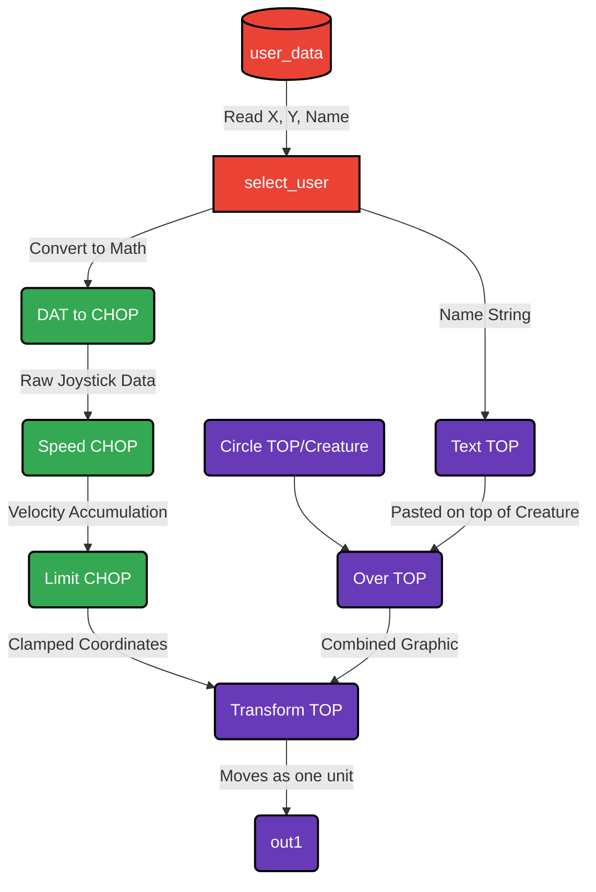

# Plan: Velocity-Based Movement & Attached Name Tags

You identified two crucial gameplay mechanics that need to be fixed for a good user experience. Right now, the character is hard-coded to snap back to the center of the screen when you let go of the joystick (absolute position), and the name tags are detached and overlapping at the top.

Here is the exact plan to fix both issues strictly inside TouchDesigner, without needing to touch the web code.

## 1. The Joystick Problem (Velocity vs Absolute)
**The Cause:** Right now, when you let go of the mobile joystick, the phone sends `X: 0, Y: 0`. TouchDesigner applies those coordinates directly to the triangle, immediately teleporting it back to the exact center of the screen.
**The Fix:** We will introduce a **Speed CHOP** inside the `player_master` template. 
* The joystick will now act as a throttle (velocity). 
* Pushing the joystick right (`X: 1`) will tell the Speed CHOP to *increase* the X coordinate continuously. 
* Letting go of the joystick (`X: 0`) tells the Speed CHOP to stop increasing, meaning the triangle will stop moving and **stay exactly where it is**.
* We will also add a **Limit CHOP** to act as a wall, preventing players from driving off the edge of the screen forever.

## 2. The Name Tag Problem (Attachment)
**The Cause:** Inside `player_master`, the Text TOP (name tag) and the Circle TOP (triangle) are being generated independently. The Text TOP is hard-coded to sit at the top of the screen, while only the triangle is connected to the Transform node that moves it around.
**The Fix:** We will combine them *before* they move.
1. We will use an **Over TOP** to stick the Name Tag slightly above the Triangle.
2. We will take that *combined image* and plug it into the Transform TOP. 
3. Now, when the Speed CHOP moves the Transform TOP, the name tag will perfectly ride on top of the triangle wherever it goes.

## The New `player_master` Node Architecture

If you approve this plan, I will write a TouchDesigner script to automatically rebuild the inside of your `player_master` to look exactly like this:

### Action Required
Review the plan and the flowchart above. If this aligns with your vision for the controls and the UI, let me know and I will execute the Python script to rebuild your `player_master`!
